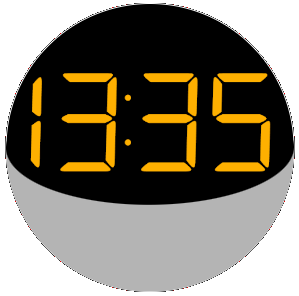
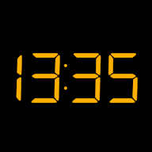
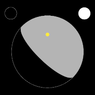
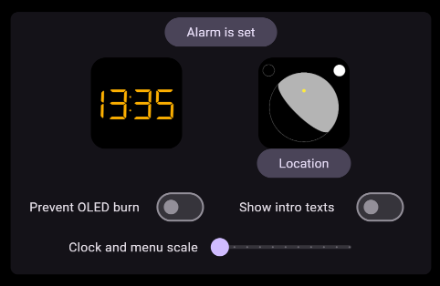
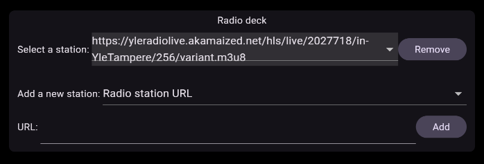
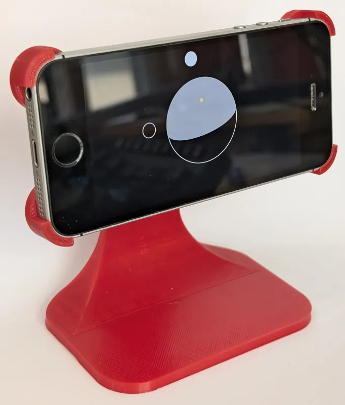

# S-1335 clock radio

Run in browser at [clock.tazca.com](https://clock.tazca.com).

An app to replace a dead clock radio and retire a 1st gen iPhone SE with dignity. For details specific to this use case, you can check my [brief journal article](https://tazca.com/journal/2024-07-flutter.html#orgcc9dcc2). A narrative documentation covering the whole codebase can be found on this repository's [github.io page](https://tazca.github.io/s1335).

# Screenshots

 

# Known issues and limitations

- Digital clock face is blurred on mobile Safari. Safari has infamously poor SVG rendering, and the alternative CanvasKit renderer is not loading on my Apple setups at all.
- Mobile Safari may show black screen. Just add to home screen, start the app from there and it will load.
- Digital clock face is 24h-only.

# Usage

Drag the clock face seen on startup left or right to see general settings and radio settings respectively. Alarm function is kept true to my original clock radio. It will start playing the radio at set time each day, until alarm is turned off from settings.

# Compilation

I compile the project as shown in their [Getting started](https://docs.flutter.dev/get-started/install) section using [VSCodium](https://vscodium.com) as IDE with its well integrated Dart/Flutter plugin. Android builds show just white screen and iOS requires payment, so those are personally off the table for now.

# Tests

There are no tests currently, as most functionality and layouting is non-trivial to test and manual testing covers most issues at this scale. If I retain interest in the project, I'll make an automatic test suite as part of a larger refactor.

# Todo

- Add a checkbox to randomize what station is played on alarm
- Show `media_kit` errors to user for diagnosing radio issues
- Disentangle solar clock face's wireframe presentation from OLED burn-in prevention, and allow scheduling it for night time for displays that don't go very low on brightness.
- Allow putting nicknames for radio station URLs.
- Work out how to produce a usable build for obsolete Android devices (or for Android at all).
